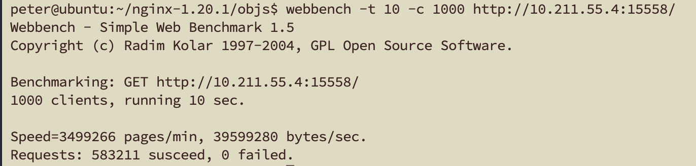
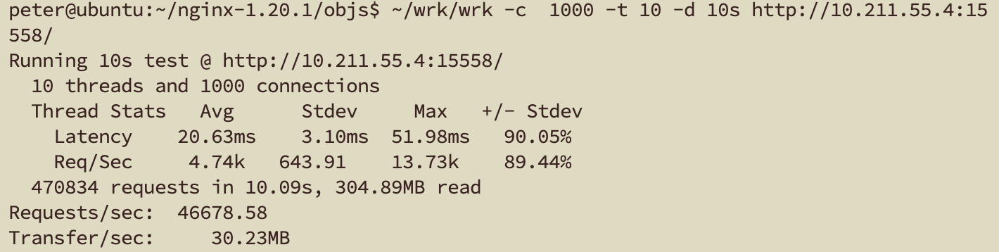
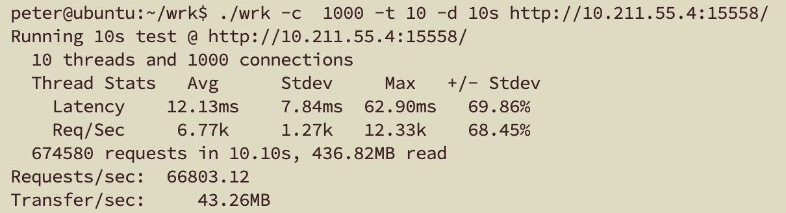

#### 单线程ping-pong

Dagger：平均187.703M/S

Muduo：平均182.453M/S

Asio：平均235.197M/S

#### ping-pong -Dagger

server单线程，client单线程，消息大小16k：

- 1条连接：163.031M/S
- 10条连接：1266.06M/S
- 100条连接：1128.03M/S
- 1000条连接：805.141M/S

server多线程，client多线程，消息大小4k：

- 10条连接：1421.8M/S
- 100条连接：2060.25M/S
- 1000条连接：1193.53M/S

#### Webbench

#### 单线程 wrk

#### 多线程 wrk

